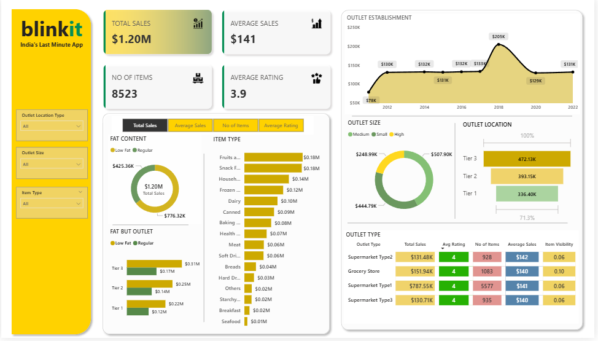

# 📊 Blinkit Data Analysis Capstone Project

## 🚀 End-to-End Data Analysis using SQL, Excel & Power BI

---

## 📌 Project Overview

This project presents a complete end-to-end data analysis of Blinkit's grocery sales dataset.
The objective was to analyze sales performance, customer satisfaction, and outlet distribution to derive meaningful business insights using SQL and Power BI.

The project follows a structured analytics workflow:

> Data Collection → Data Understanding → Data Cleaning → SQL Analysis → KPI Calculation → Data Visualization → Business Insights

---

# 🎯 Problem Statement

To conduct a comprehensive analysis of Blinkit's sales performance, customer satisfaction, and outlet distribution in order to identify key insights and optimization opportunities using key performance indicators (KPIs) and interactive dashboards.

---

# 📂 Project Files (Click to Open)

* 📊 **[Data](./BlinkIT%20Grocery%20Data%20%282%29.xlsx)**
* 🧠 **[SQL Documentation](./Query%20Doc%20%281%29.docx.pdf)**
* 📈 **[Power BI Dashboard](./capstone%20blinkit%20data%20analysis%20project.pbix)**
* 🖼 **[Dashboard Preview](./dashboard.png)**

---

# 🛠 Tools & Technologies Used

* SQL (Data Cleaning & Analysis)
* Excel (Data Review & Understanding)
* Power BI (Data Visualization & Dashboarding)
* DAX (Calculated Measures)
* GitHub (Project Documentation)

---

# 📊 Step-by-Step Project Workflow

---

## 1️⃣ Data Collection

The dataset contains grocery sales information including:

* Item Type
* Item Fat Content
* Outlet Type
* Outlet Size
* Outlet Location Tier
* Outlet Establishment Year
* Total Sales
* Rating
* Item Visibility

The dataset was imported into SQL Server and Power BI for analysis.

---

## 2️⃣ Data Understanding

Initial exploration was performed to:

* Understand column structure
* Identify categorical & numerical variables
* Analyze business meaning of attributes
* Check for inconsistencies in categorical values
* Review overall sales distribution

Key variables analyzed:

* `Total_Sales`
* `Rating`
* `Item_Fat_Content`
* `Outlet_Type`
* `Outlet_Location_Type`
* `Outlet_Size`

---

## 3️⃣ Data Cleaning (Using SQL)

To ensure data consistency, categorical values were standardized.

Example: Cleaning the `Item_Fat_Content` column:

```sql
UPDATE blinkit_data
SET Item_Fat_Content =
CASE
WHEN Item_Fat_Content IN ('LF', 'low fat') THEN 'Low Fat'
WHEN Item_Fat_Content = 'reg' THEN 'Regular'
ELSE Item_Fat_Content
END;
```

This improved grouping accuracy during aggregation and reporting.

---

## 4️⃣ KPI Calculation

Primary KPIs calculated using SQL:

* 📈 Total Sales
* 📊 Average Sales
* 🧾 Number of Items
* ⭐ Average Rating

Example query:

```sql
SELECT CAST(SUM(Total_Sales) / 1000000.0 AS DECIMAL(10,2)) AS Total_Sales_Million
FROM blinkit_data;
```

---

## 5️⃣ Business Analysis Performed

### 🔹 Total Sales by Fat Content

Analyzed revenue contribution by product fat category.

### 🔹 Total Sales by Item Type

Identified top-performing product categories.

### 🔹 Fat Content by Outlet Location

Used SQL PIVOT to compare fat category sales across locations.

### 🔹 Sales by Outlet Establishment Year

Evaluated outlet age impact on revenue.

### 🔹 Percentage of Sales by Outlet Size

Used window functions to calculate revenue share contribution.

### 🔹 Sales by Outlet Location Tier

Compared Tier 1, Tier 2, and Tier 3 performance.

### 🔹 All Metrics by Outlet Type

Calculated:

* Total Sales
* Average Sales
* Number of Items
* Average Rating
* Item Visibility

---

# 📊 Power BI Dashboard

After SQL analysis, the cleaned dataset was imported into Power BI to build an interactive dashboard.

### Dashboard Components:

* KPI Cards (Total Sales, Avg Sales, No of Items, Avg Rating)
* Outlet Establishment Sales Trend
* Donut Charts (Fat Content & Outlet Size)
* Bar Charts (Item Type Performance)
* Sales by Outlet Location Tier
* Outlet Type Comparison Table
* Interactive Filters & Slicers

---

# 📸 Dashboard Preview



---

# 📈 Key Insights

* Tier 3 outlets generate the highest total sales.
* Medium-sized outlets contribute the largest revenue share.
* Low Fat products significantly contribute to revenue.
* Supermarket Type 1 leads in total sales.
* Fruits & Vegetables category dominates overall performance.
* Average customer rating remains stable around 3.9.

---

# 📚 Learning Outcomes

Through this project, I gained hands-on experience in:

* Writing SQL aggregation & PIVOT queries
* Using window functions for percentage calculations
* Cleaning categorical data efficiently
* Designing business KPIs
* Building interactive dashboards
* Structuring a professional GitHub portfolio project


# 🚀 Conclusion

This project demonstrates a full business intelligence workflow from raw data to actionable insights using SQL and Power BI.

It reflects practical data analytics skills suitable for entry-level Data Analyst and Business Intelligence roles.


